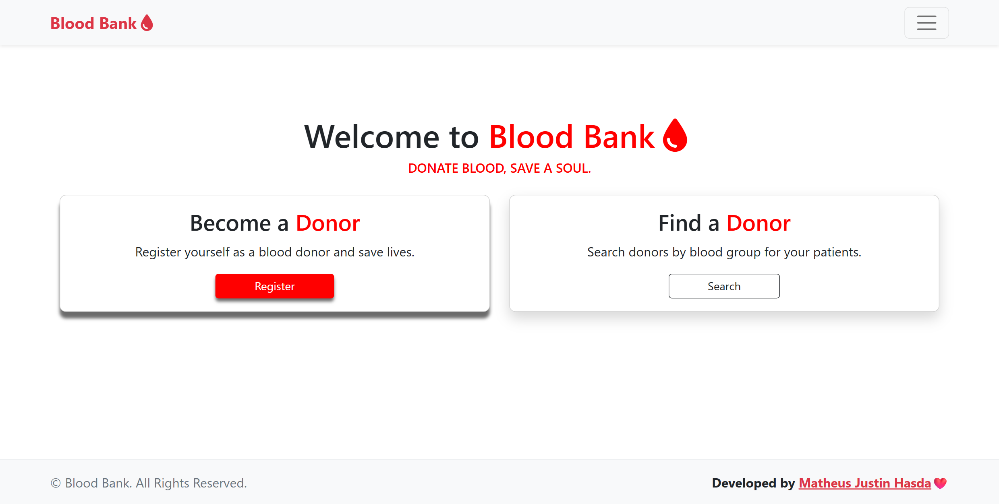
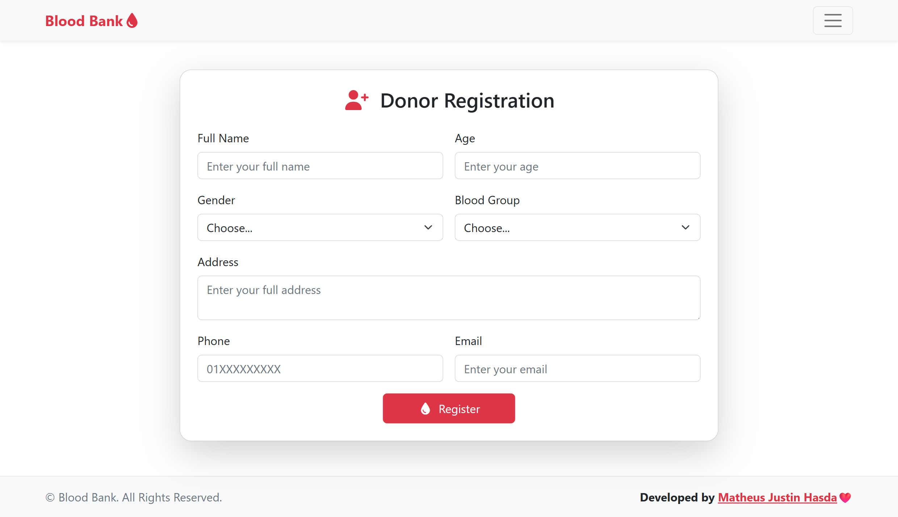
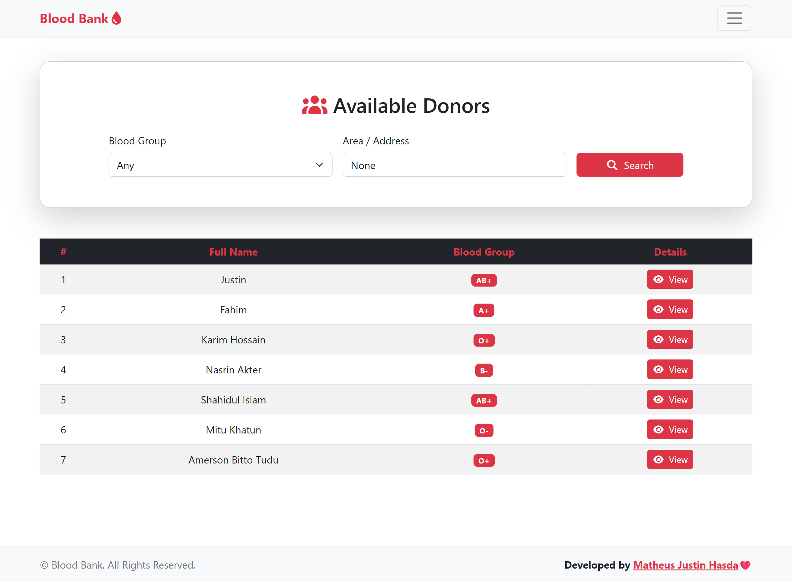
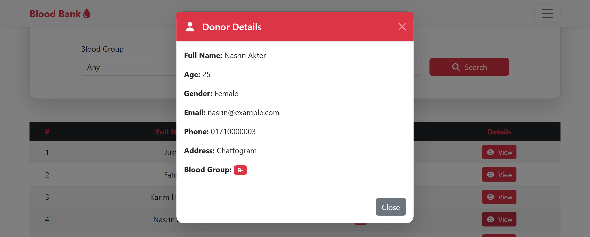

# Blood Bank Web Application
A simple **Blood Bank Management System** built with **Django** and **Bootstrap**.  
This project allows users to **register as a blood donor** and lets others **search for donors** based on **blood group** and **area**.

---

## Features
- **Donor Registration**

- **Search Donors**
  - Filter by **Blood Group**
  - Filter by **Area / Address**

- **Donor List**
  - View all registered donors
  - Modal popup for donor details

- **UI/UX**
  - Bootstrap 5 + Font Awesome
  - Responsive design
  - Offcanvas Navbar & Footer

---

## Tech Stack
- **Backend**: Django (Python)
- **Frontend**: HTML, CSS, JS, Bootstrap 5
- **Database**: SQLite
- **Icons**: Font Awesome

---

### Home Page

### Donor Registration

### Donor List

### Donor Details 
